# Monty's Inn
## Room Booking System

Monty's Inn Room Booking System is a Command Line Interface (CLI) application for users to book a stay in the fictional beachfront Inn with a Monty Python theme. Users can check availabilty for any of the 10 rooms Monty's Inn has to offer. Rooms also have a different number of beds, different facilities and different views. Users will be able to book a room and cancel the reservation at a later date if required. All room prices include the cost of breakfasts which consist of spam, eggs and ham.

View the live app here - https://montys-inn.herokuapp.com/

## Contents
* [Description](#room-booking-system)
* [User Stories](#user-stories)
* [Structure](#structure)
* [Technologies Used](#technologies-used)
* [Testing](#testing)
* [Deployment](#deployment)
* [Credits](#credits)

## User stories

* User Goals
    * The user wants to be able to check availabilty for the room they require to book.
    * The user wishes to choose a room depending on number of beds required, type of facilities (WC or full En Suite), and type of view.
    * The user wants to be able to book the room and recieve a calculated cost for the stay.
    * The user wants to be able to return to the application and cancel a booking.

* Owner's Goals
    * The owner wants to validate the user input to ensure the application runs without issue.
    * The owner wants to take user information to assign bookings to the user.
    * The owner wants to use the user information to reference the users booking in the event the user wishes to cancel the booking.

## Structure

This flowchart, created with [lucid.app](https://lucid.app), shows the flow of the app's logic.

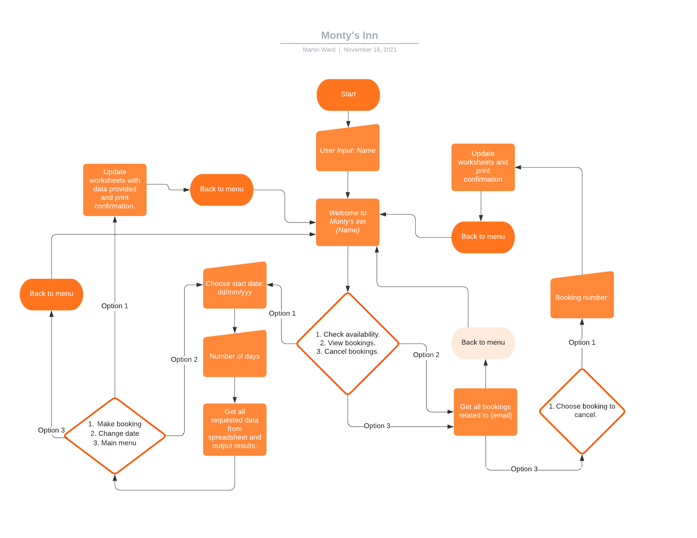

### Welcome Screen

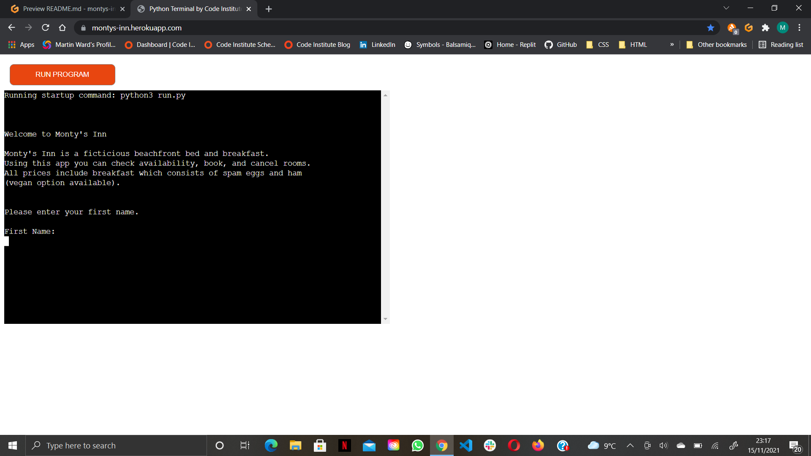
The user starts off at the welcome screen. This screen tells the user the app is a bed and breakfast room booking app. The app asks the user for their first name, last name and email address. The app validates the name fields are not empty and validates the email address matches a Regular Expression pattern before advancing. If incorrect details are input, the user is asked to re-enter the details.

### Main Menu

The main menu greets the user by their first name and offers a choice on 3 options. 1. Check for availability and book a room. 2. View bookings. 3. Cancel bookings.
This menu is also validated, anything other than 1, 2 or three will raise an error and the user is asked to re-enter the option.

### Booking Option

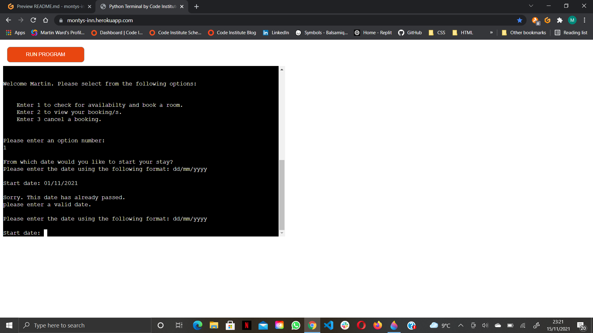
The booking option takes a date in the format dd/mm/yyyy and validates it for correct format against a Regular Expression pattern. Then the date is checked to see if it's in range of the bookings worksheet which holds all the room, date and pricing data. Finally the date is checked against today's date, using the datetime module, to make sure the selected date hasn't already passed. Once the date is validated, the user is then asked for the number of night's they wish to stay. This input is validated to make sure an integer is entered.

#### Bookings Worksheet

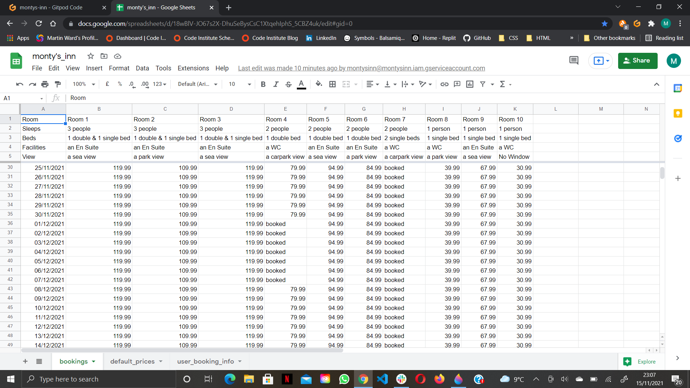

### Available Rooms

Using the date and duration the user entered, the app searches this range of data in the bookings worksheet and checks to see if any of the price cells in the range contain the string "booked". If they do, the room isn't added to the available rooms list. If they are available, the app displays information for each room in a list and calculates the cost for the stay. Once the dynamic list is compiled the user has the option of selecting a room to book, selecting a different date or returning to the main menu. The input is validated to make sure it's an integer and in the list of choices.

### Booking Confirmation

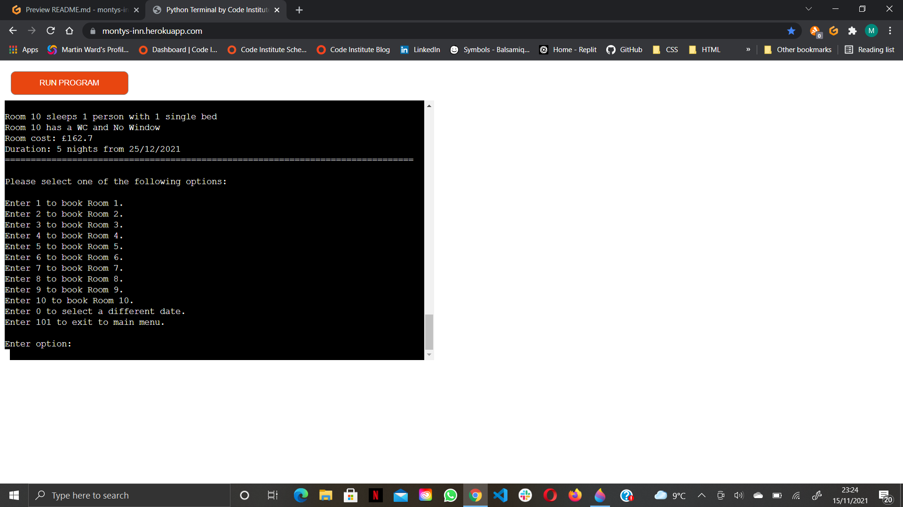
When a room is selected, the prices in the date range for that room are changed to the string "booked" and the user's booking details are stored in the user booking info worksheet (this gives the booking an id for use in cancellation). The room details are displayed again with a confirmation message and the user is taken back to the main menu.
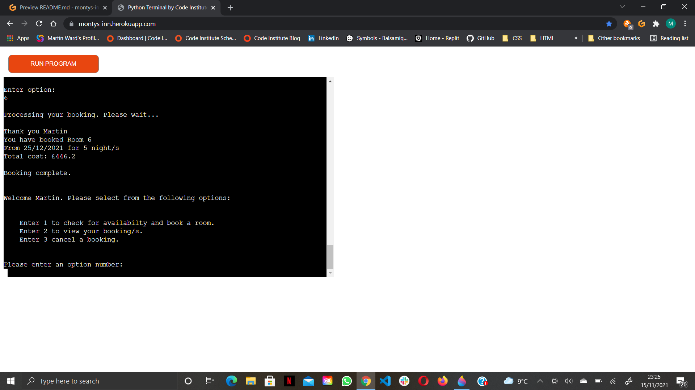

#### User Booking Info Worksheet

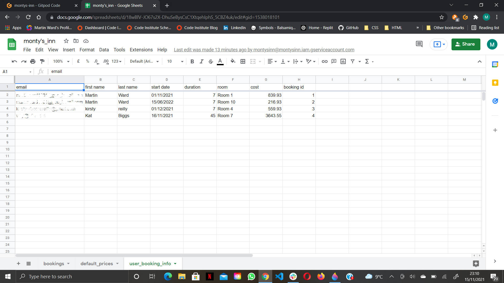

### View Bookings

The view bookings option uses the email address the user entered at the start screen and checks the user booking info worksheet for a match. If there is a match, a list of rooms booked by the user is compiled. If the email address doesn't match, the user is redirected back to the start screen to re-enter their details and try again.

### Cancel Bookings

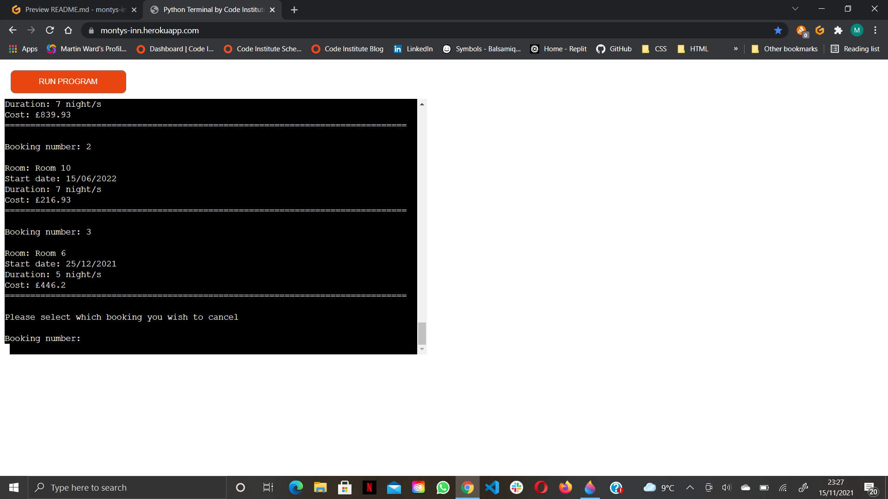
The cancel booking option uses the "view bookings" function to compile a list of the user's bookings to cancel. Each booking is given a number which the user enter's to confirm they want to cancel that room. The entry is validated to make sure it's an integer and in the list. Then, using a default prices worksheet (a duplicate of the bookings worksheet without any bookings), the app extracts the original prices for the requested cancellation and replaces the "booked" strings in the bookings worksheet before deleting the relevant user data in the user bookings info worksheet. A confimation message is displayed and the user is returned to the main menu.
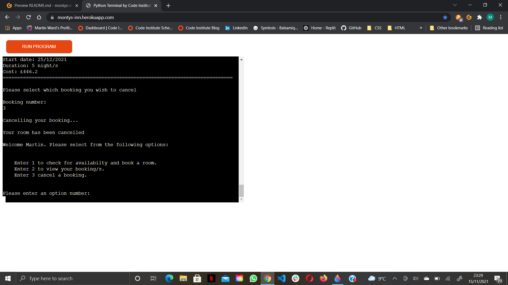 

## Technologies Used

### Python

The whole project is written in Python with the use of modules and APIs to interact with user input and [Google Sheets](https://www.google.co.uk/sheets/about/).
To make the code a little easier to read, all validator functions were added to a separate file (validate) and imported into the main file (run).

### Regular Expressions (re)

The Regular expressions (re) module was imported to the validator file for use in validator functions to match user inputs against re patterns.

### Datetime (Date)

Date (date) from the datetime module was imported to the validator file to match today's date against user input, and ensure past dates are not entered.

### GSpread (gspread)

GSpread was installed and imported to enable Python to communicate with [Google Sheets](https://www.google.co.uk/sheets/about/).

### Google Oauth2

Credentials was imported from the installed Goole Outh2 to allow Python to access [Google Sheets](https://www.google.co.uk/sheets/about/).

### Google Sheets

[Google Sheets](https://www.google.co.uk/sheets/about/) was used to store and manipulate all data for the app. As the worksheets store user information, and I don't have consent to share their data, I can't add a link to the sheets used in this app.

## Testing

### PEP8 Linter

The majority of testing was done during the development process, and with the use of tools such as [pylint](https://pylint.org/) and [flake8](https://flake8.pycqa.org/en/latest/). Upon completion of the project the code was run through the [PEP8 Linter](http://pep8online.com/) website to catch any missed errors.
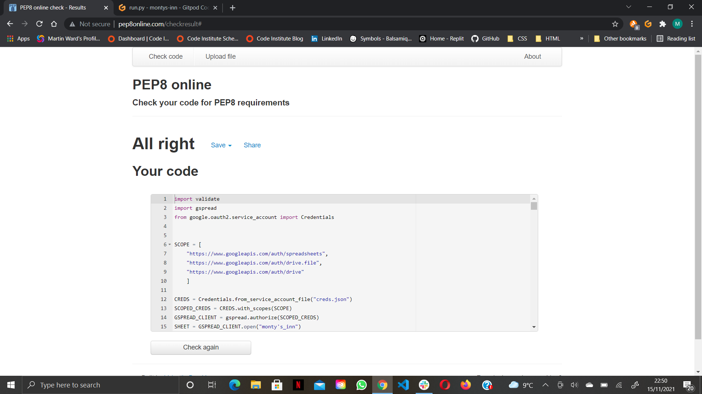
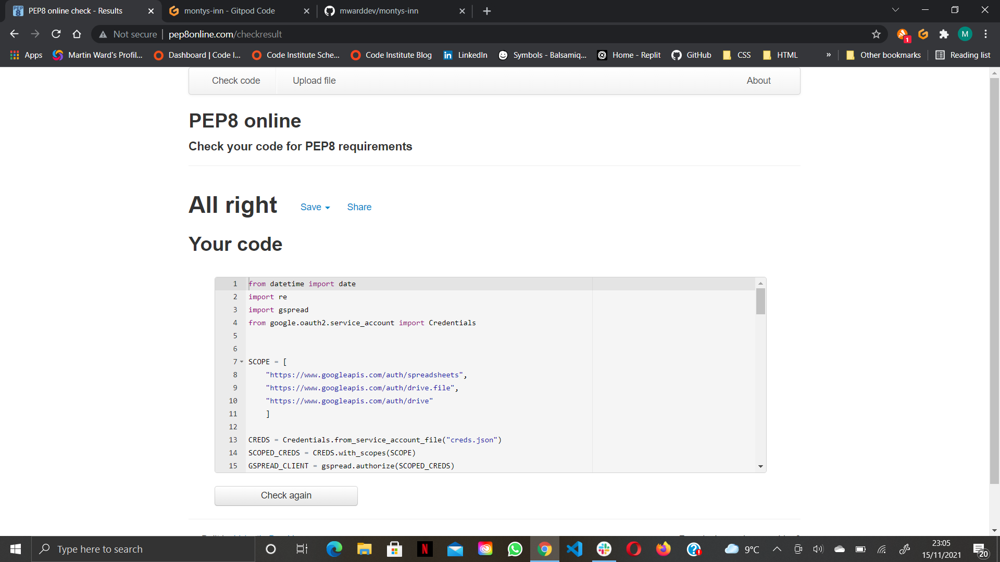
Both files returned no errors.

### Peer Code Reviews

The site link was shared with family and friends to test for errors. 1 substantial bug discovered (see Stress Testing).

### Stress Testing
#### Bug Fix

A peer code review test revealed an API error when cancelling a booking with an excessive amount of nights (60). Gspread threw the exception "gspread exceptions API error: Limit exceeded for read & write requests per minute per user". The code was then run in quick succession, booking and cancelling a slowly reducing number of nights until a stable number (14) was discovered not to raise the error. The validate_duration function was then updated to limit the number of bookable nights to 14.

### Value Errors
#### Bug Fixes

During the stress testing exercise a typo was made whilst navigating menus and and empty value was issued rasing a value error for the "Cancel booking menu". This error was amended in the "cancel" function with a conditional statement checking for an empty string. All other menus were then checked for the same issue the duration function was amended to fix this bug too. All menu inputs were then tested with string inputs instead of numbers. this threw up value errors for the duration function and book_room function. The validator function was re-written for the duration function and a new validator function was written for the book_room function. The book_room function was then amended to work with the validator.
No other bugs recorded.

## Deployment

The repository for this project was created in [GitHub](https://github.com/) and the project was deployed to [Heroku](https://id.heroku.com/) as GitHub pages is not a suitable platform for this type of application.
The following are the steps taken to deploy to Heroku.

* Add new line character to the end of each input request to allow the code to work correctly in the deployed mock terminal.
* Create a list of requirements to allow the code to run by populating the requirements file by running the command "pip3 freeze > requirements.txt" in the terminal.
* Commit and push changes to GitHub.
* Login to Heroku and click "Create new app".
* Give the app a unique name and select region (Euroupe). the click "Create app".
* Click the settings tab and click "Reveal config vars".
* Type "CREDS" (all caps) into the "KEY" field, then go to the GitPod workspace and copy the contents of the "creds.json" file and paste it into the VALUE field in Heroku settings. This is needed for Heroku to have all the necessary permissions to run the app once deployed.
* Add the word "PORT" (all caps) into the next "KEY" field and the number 8000 into the "VALUE" field to allow the mock terminal to work correctly.
* Scroll down and click on "Add buildpack". Click "Python" and save changes.
* Add another buildpack for Node.js by clicking and saving changes again. The buildpacks should be in the order of Python above Node.JS to ensure Python is installed first when deploying the app.
* Scroll to the top and click on the "Deploy" tab.
* Select GitHub as the deployment method (as that is where the repo is located) and then confirm connection to GitHub.
* Type the name of the repository (montys-inn) in the search field and click "Search".
* When the repository is found, click the "Connect" button next to the repository name.
* Click the "Deploy Branch" button to build the app.
* Once the app is built, a success message is displayed along with a button to view the live app. Before clicking the button to view the app, click the "Enable Automatic Deploys" button to update the app automatically each time new commits are pushed to GitHub if the app is still under developement.
* Click the button to view the app and test the program.
* Check the spreadsheet is updating as expected.

The App is successfully deployed.

## Credits

* Inspiration for the code layout was taken from the "Love Sandwiches" walkthrough project from [Code Institute](https://codeinstitute.net/).

* My course material learned from [SoloLearn](https://www.sololearn.com/home) was used for a refresher on working with the Regular Expressions module.

* [StackOverflow](https://stackoverflow.com/) was a useful resource for syntax issues.

* [docs.python.org](https://docs.python.org/3/) was a good resource for working with the datetime module.

* Finally. A big thank you to friends and family for offering advice and helping to test the app.

