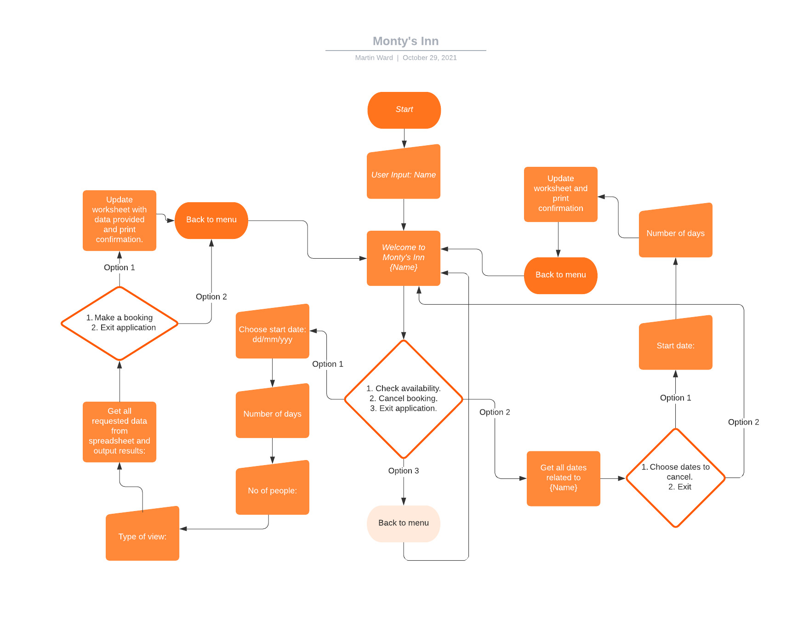

# Monty's Inn
## Room Booking System

Monty's Inn Room Booking System is a Command Line Interface (CLI) application for users to book a stay in the fictional beachfront Inn with a MOnty Python theme. Users can check availabilty for any of the 10 rooms Monty's Inn has to offer. Rooms also have a different number of beds, different facilities and different views. Users will be able to book a room and cancel the reservation at a later date if required. All room prices include the cost of breakfasts which consist of spam, eggs and ham.

## User stories

* User Goals
    * The user wants to be able to check availabilty for the room they require to book.
    * The user wishes to choose a room depending on number of beds required, type of facilities (WC or full En Suite), and type of view.
    * The user wants to be able to book the room and recieve a calculated cost for the stay.
    * The user wants to be able to return to the application and cancel a booking.

* Owner's Goals
    * The owner wants to validate the user input to ensure the application runs without issue.
    * The owner wants to take user information to assign bookings to the user.
    * The owner wants to use the user information to reference the users booking in the event the user wishes to cancel the booking.

## Structure

The flowchart created with [lucid.app](https://lucid.app) shows the flow of the app's logic.

